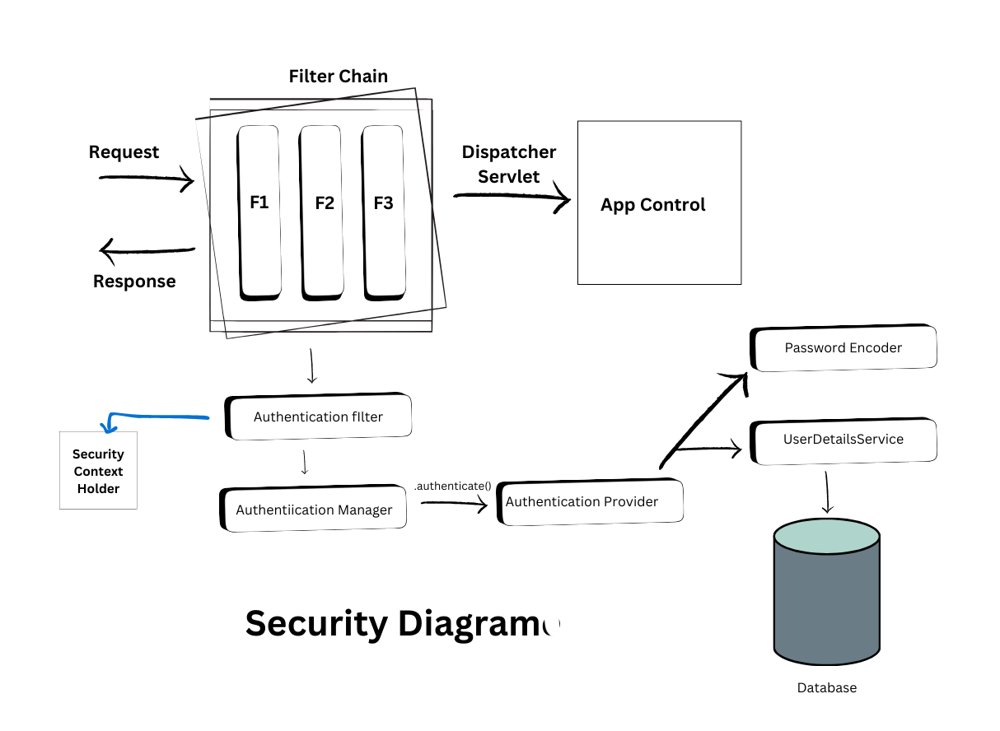

# Security + JWT Implementation

### Spring boot Security Diagram

Some basic steps we need

1. Customizing User class  
2. User information from database(MySQL) for authentication
3. Customizing Security configuration
4. JWT implementation


### 1. Customizing User Class

- we can customize our user class according to our needs.
```java
@Getter
@Setter
@Entity
@Table(name = "users")
public class User {

    // Getters and Setters
    @Id
    @GeneratedValue(strategy = GenerationType.AUTO)
    private Long id;

    @NotBlank(message = "Email is required")
    @Column(unique = true, nullable = false)
    private String email;

    @NotBlank(message = "Password is required")
    private String password;

    // Default constructor required by JPA
    public User() {
    }
}
```
- 
